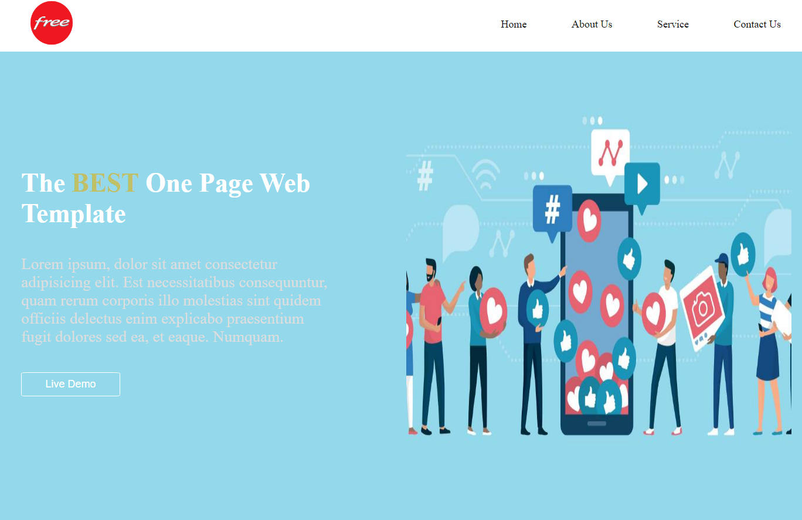

# sec-project-iti
Second Project from iti is an exercise about html and css to high your skills in html and css by using serposive layout and media quire to make website interactive with all screens.

 

## Live Site:  
   - Link: https://ahmed-abo-rafat.github.io/simple-profile/

## Technologies
Project is created with:
   - HTML
   - css
   - Responsevie Layout
   - Media quires

